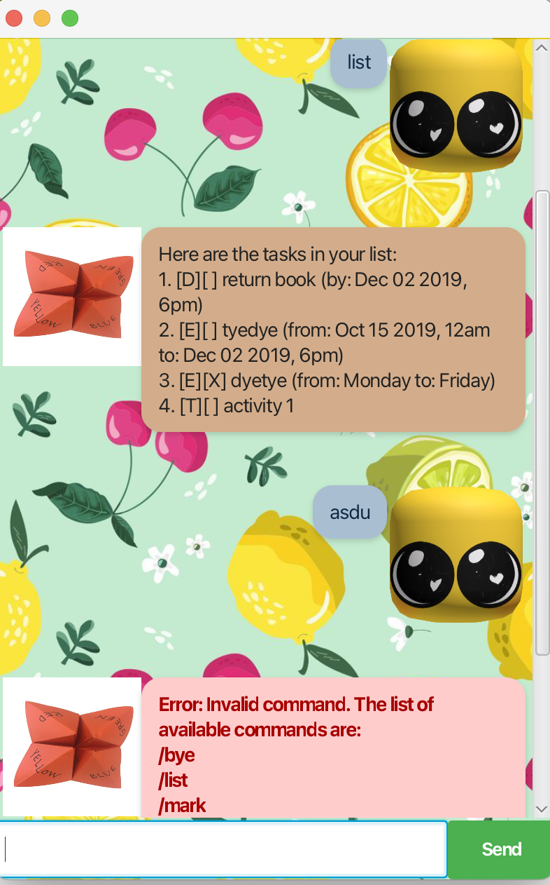

## MrYapper 💬

MrYapper is your friendly personal task manager chatbot with a chat-style interface.  
It helps you keep track of **to-dos, deadlines, and events** while chatting naturally with you.

---

## ✨ Features

### ➕ Add tasks (deadlines, events, todos)
MrYapper lets you add different kinds of tasks:

- **Todo** – tasks without a date/time
- **Deadline** – tasks with a due date
- **Event** – tasks with a start/end time

Example usage:
> todo buy milk
> deadline submit report /by 2025-09-30
> event project meeting /at 2025-09-22 14:00

Expected outcome:
> Got it. I've added this task:
> [D][ ] submit report (by: 2025-09-30)
> Now you have 3 tasks in the list.

---

### 📋 List all tasks
View everything on your list in a neatly formatted way.

Example usage:
> list

Expected outcome:
> Here are the tasks in your list:
> [T][ ] buy milk
> [D][ ] submit report (by: 2025-09-30)
> [E][ ] project meeting (at: 2025-09-22 14:00)

---

### ✅ Mark tasks as completed
Check off tasks once you’re done.

Example usage:
> done 1

Expected outcome:
> Nice! I've marked this task as done:
> [T][X] buy milk

---

### 📅 View tasks by date/time
Filter tasks to see only those happening on a specific date.

Example usage:
> schedule 2025-09-22

Expected outcome:
> Here are your tasks on 2025-09-22:
> [E][ ] project meeting (at: 2025-09-22 14:00)

---

### ❌ Delete tasks
Remove a task if it’s no longer relevant.

Example usage:
> delete 2

Expected outcome:
> Noted. I've removed this task:
> [D][ ] submit report (by: 2025-09-30)
> Now you have 2 tasks in the list.

---

### 👋 Exit the program
Say goodbye and close the app.

Example usage:
bye